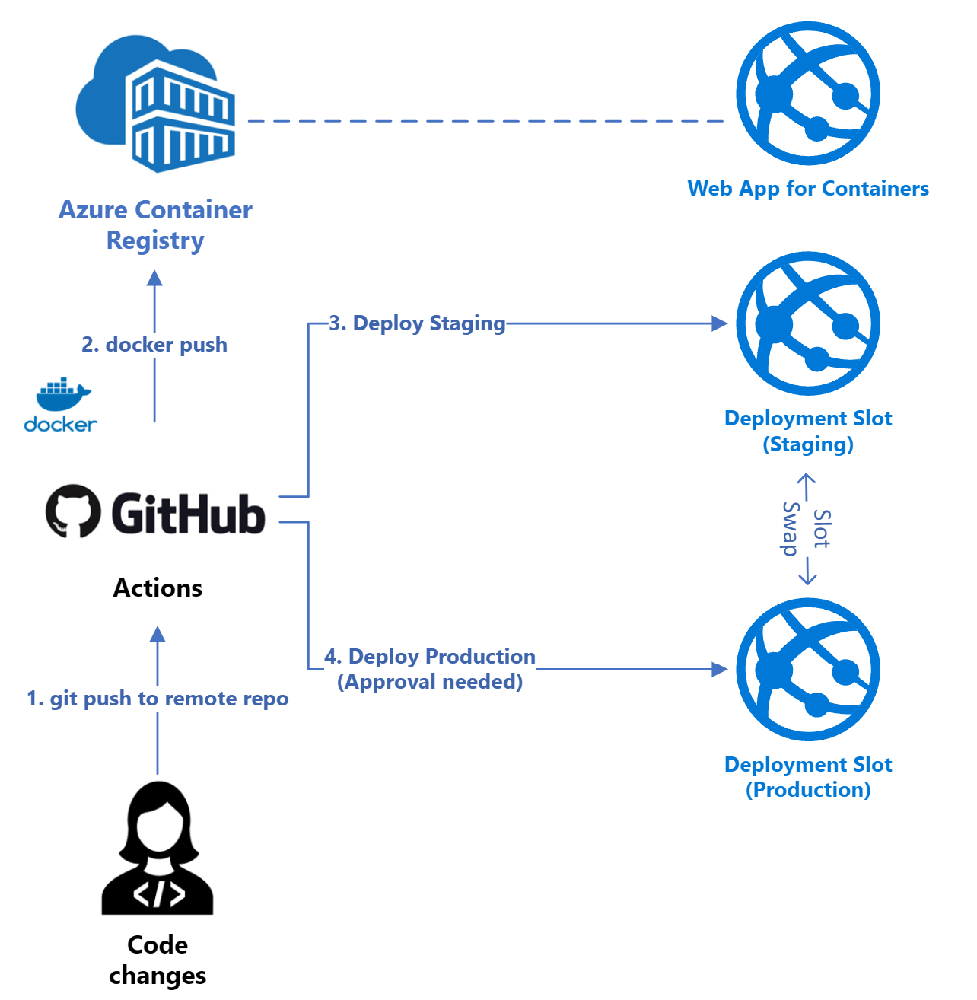

# GitHub Actions Workshop

In this workshop you will create a GitHub workflow from scratch to build, test and deploy a .NET Core container image to a private container registry in Azure. 

You will then enable continuous deployment on a Web App, so that whenever changes are made to source code, these are automatically deployed to the web app.

The architecture looks like this:

Links to the labs are below, and these are sequential - ensure you do them in order. 

[Lab 0 - Pre-requisites](docs/labs/lab.0/pre-reqs.md)

[Lab 1 - Continuous Integration](docs/labs/lab.1/lab.1.md)

[Lab 2 - Continuous Deployment Part 1](docs/labs/lab.2/lab.2.md)

[Lab 3 - Continuous Deployment Part 2](docs/labs/lab.3/lab.3.md)

On the roadmap:

I will be adding more labs to cover:

* Azure DevOps Integration (Pipelines)
* Key Vault integration
* GitHub Branch policies
* DevSecOps