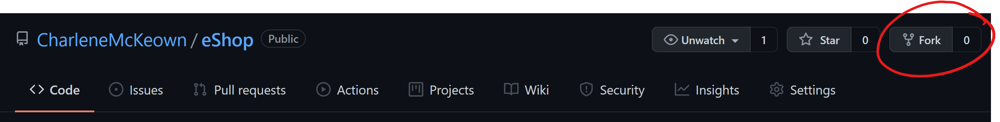

# Pre-reqs

You will need: 

* An Azure Subscription
* A GitHub Account

# Fork the repo

Log into your GitHub account, and navigate to the below repo:

https://github.com/CharleneMcKeown/eShop

Fork it to your own account by clicking on the **Fork** button:




# Deploy the infrastructure

We need an Azure Resource Group and a Container registry to get started with the labs. 

1. Log into the Azure portal and open a new cloud shell session using Bash. You may be prompted to create a storage account if you have never used it before - go ahead and do that. If you need some help getting started, read the [cloud shell overview](https://docs.microsoft.com/en-us/azure/cloud-shell/overview).

1. Copy and paste the below commands to create the resources we need, for now. 

    ```
    let suffix=$RANDOM*$RANDOM
    ```
    ```
    myResourceGroup=GitHubWorkshop$suffix
    myACR=GitHubWorkShop$suffix
    ```

    ```
    az group create --name $myResourceGroup --location "West Europe"
    ```

    ```
    az acr create --name $myACR --resource-group $myResourceGroup --sku Basic --admin-enabled true
    ```

3. Wait for the resources to create, then navigate to the Container Registry you just created.

1. Open notepad, or somewhere you can paste in some values which we will need later.  Find the:

    * **Login Server name:** (GitHubWorkShop********.azurecr.io)
    * **Username** (GitHubWorkShop********)
    * **Password** (will be a long, unique string)
> Note: You can find the login server name on the overview page, top right, and the username and password under **Access Keys** on the left hand side menu.

[Onward to Lab 1!](../lab.1/lab.1.md)
