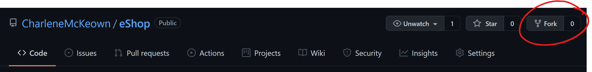

# Pre-reqs

You will need: 

* Azure Subscription
* Azure DevOps Organisation

Optional, but recommended:

* Visual Studio Code
* Git CLI

# Fork the repo

Log into your GitHub account, and navigate to the below repo:

https://github.com/CharleneMcKeown/GitHubWorkshop.git

Fork it by clicking on the **Fork** button:




# Deploy the infrastructure

Resource group and Container registry

Log into the Azure portal and open a new cloud shell session. Run the below commands to create the resources we need, for now. 

```
let suffix=$RANDOM*$RANDOM
```
```
myResourceGroup=GitHubWorkshop$suffix
myACR=GitHubWorkShop$suffix
```

```
az group create --name $myResourceGroup --location "West Europe"
```

```
az acr create --name $myACR --resource-group $myResourceGroup --sku Basic --admin-enabled true
```


Put the next few as part of the lab instead. 

```
az appservice plan create --name myAppServicePlan --resource-group myResourceGroup --sku F1 --is-linux
```

```
az webapp create --resource-group myResourceGroup --plan myAppServicePlan --name <app-name> --runtime "DOTNETCORE|2.2"
```