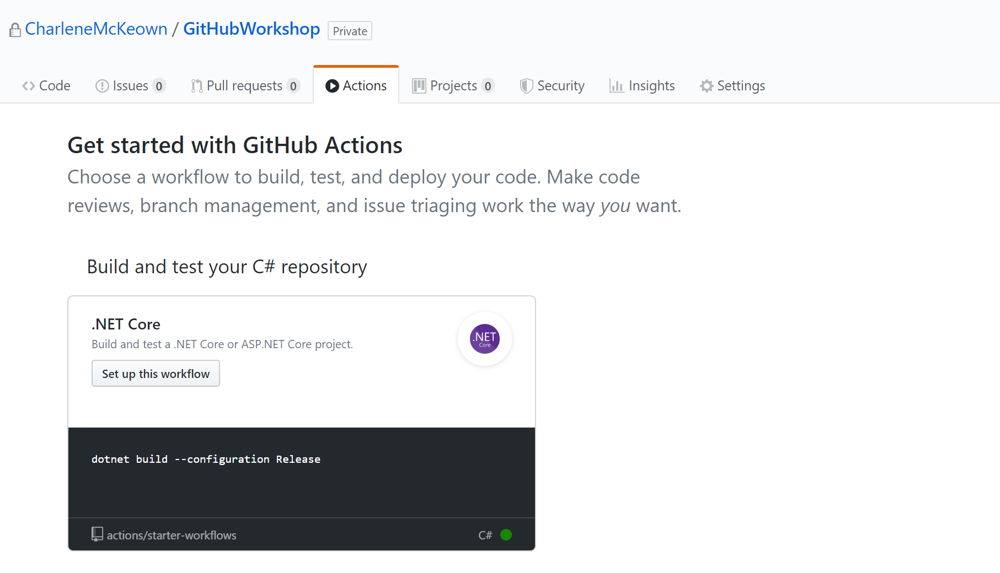
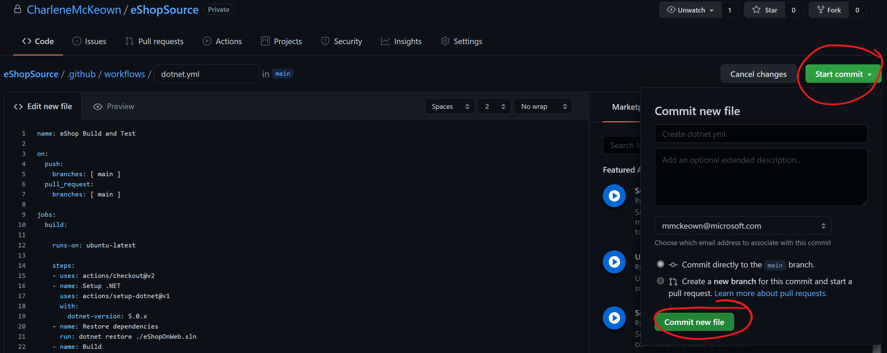
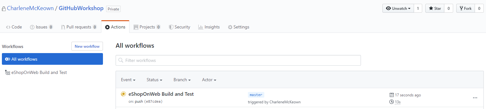
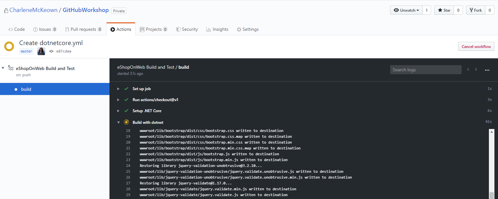

# Continuous Integration

Go to your newly created repo (from the one you forked earlier) and explore the source code.

We have a .Net Core application called eShopOnWeb which we want to deploy as part of this workshop.

##Create your first Action

GitHub Actions are a way for us to do something with our code, in an automated way.  We can build it, test it, scan it for secrets, push it somewhere else, and even deploy it to some infrastructure somewhere.  

1. Click on the **Actions** tab in your repo.  You will see that GitHub is already aware of what code is in the repo, and is smart enough to present us the option of a starter workflow for .NET Core.  Click **Set up this workflow** as shown in the picture below.



You will see that GitHub will now create a file called dotnetcore.yml in /.github/workflows for us.  

2. We need to change a few things in this file to get this working for our code. 

- On line 15, replace **2.2.108** with **3.1.100**
- On line 17, after build, paste in **./eShopOnWeb.sln** so that the line now reads: 
**run: dotnet build ./eShopOnWeb.sln --configuration Release**
- Add in two more lines to run some tests on our .NET project:
    **- name: Test with dotnet**
    **run: dotnet test ./eShopOnWeb.sln --configuration Release**

Indentation is important, so please make sure your file now looks like the below:

```
name: eShopOnWeb Build and Test

on: [push]

jobs:
  build:

    runs-on: ubuntu-latest

    steps:
    - uses: actions/checkout@v1
    - name: Setup .NET Core
      uses: actions/setup-dotnet@v1
      with:
        dotnet-version: 3.1.100
    - name: Build with dotnet
      run: dotnet build ./eShopOnWeb.sln --configuration Release
    - name: Test with dotnet
      run: dotnet test ./eShopOnWeb.sln --configuration Release
```
You can see that the workflow has a **name** (eShopOnWeb Build and Test) and consists of a single **job** (build).  It runs on a virtual machine in a hosted GitHub environment, which in this case is the latest Ubuntu image available to us.  We could alternatively specifiy a specific Ubuntu image, or choose a Windows image instead. 

The **job** consists of a number of **steps**. Each step has a name, and uses a particular version of an **action**. For example, we are using actions/setup-dotnet@v1 for our step called "Setup .NET Core". 

3. Click **Start Commit**.  This now commits the file to our repo, and will automatically start the workflow.  Why? 



You will notice on line 3, it reads **on: [push]**. This means that the workflow will run when a new commit is pushed to our repo - which we just did!


4. Click on **Actions** to view our workflow, which should still be running. 



5. Click on the workflow to see a live view of what's happening at each stage of our workflow.



After a few minutes, the workflow will finish and you should see a green tick beside it.  Success!

In the next lab, we will add some more steps to the workflow to build a Docker image and deploy that image to the Container Registry you created earlier.