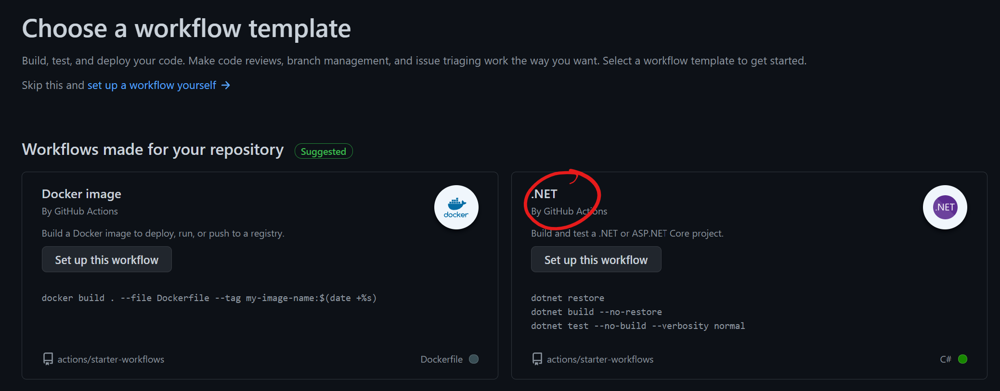

# Getting Started with Actions

Go to your newly created repo (from the one you forked earlier) and explore the source code.

We have a .Net Core application called eShopOnWeb which we want to deploy as part of this workshop.

## Create your first GitHub Action

A GitHub Workflow is an automated process made up of jobs. They are configurable YAML files, and must be stored in a particular folder in your repo - **./github/workflows/**. 

GitHub Actions are a way for us to do something with our code, in an automated way.  We can build it, test it, scan it for secrets, push it somewhere else, and even deploy it to infrastructure somewhere.  Actions can also be used to automate other tasks, such as labelling issues or closing inactive issues. 

1. Click on the **Actions** tab in your repo.  You will see that GitHub is already aware of what code is in the repo, and is smart enough to present us the option of a starter workflow for .NET.  Click **Set up this workflow** as shown in the picture below.

    

    You will be presented with a workflow file that you can edit in the browser. Notice that GitHub is automatically suggesting that a yaml file called dotnet.yml be created in the appropriate folder - /.github/workflows. Feel free to change the name of the file to something more descriptive - like build.yml. 

    <br>

1. We need to change a few things in this file to get this working for our code. 

    - On line 1, update name to **eShop Build and Test**
    - On line 21, after dotnet restore, paste in **./eShopOnWeb.sln**
    - On line 23, after dotnet build, paste in **./eShopOnWeb.sln --configuration Release** so that the line now reads:<br> 
    **run: dotnet build ./eShopOnWeb.sln --configuration Release**
    - On line 25, after dotnet test, paste in **./eShopOnWeb.sln** so that the line now reads:<br>
    **run: dotnet test ./eShopOnWeb.sln --configuration Release**

    Indentation is important, so please make sure your file now looks like the below. Copy and paste it if you need to:

    ```
    name: eShop Build and Test

    on:
      push:
        branches: [ main ]
      pull_request:
        branches: [ main ]

    jobs:
      build:

        runs-on: ubuntu-latest

        steps:
        - uses: actions/checkout@v2
        - name: Setup .NET
          uses: actions/setup-dotnet@v1
          with:
            dotnet-version: 5.0.x
        - name: Restore dependencies
          run: dotnet restore ./eShopOnWeb.sln
        - name: Build
          run: dotnet build ./eShopOnWeb.sln --configuration Release
        - name: Test
          run: dotnet test ./eShopOnWeb.sln --configuration Release
    ```
    You can see that the workflow has a **name** (eShop Build and Test) and consists of a single **job** called build.  It runs on a virtual machine in a hosted GitHub environment, which in this case is the latest Ubuntu image available to us.  We could alternatively specifiy a specific Ubuntu image, or choose a Windows image instead. 

    The **job** consists of a number of **steps**. Each step has a name, and uses a particular version of an **action**. For example, we are using actions/setup-dotnet@v1 for our step called "Setup .NET".

    >Note: It is recommended to reference a specific version of an Action. You can reference them by using tags (as in our example - @v1), using SHA values or even by branch name. 

1. Click **Start Commit**.  This now commits the file to our repo, and will automatically run the workflow.  Why? 

    

    The workflow is currently triggered by pushes to the main branch: 

    ```
    on:
      push:
        branches: [ main ]
      pull_request:
        branches: [ main ]
    ```
    This means that the workflow will run when a new commit is pushed to our repo - which we just did!


1. Click on **Actions** to view the workflow, which should still be running.

    

1. Click on **build** the to see a live view of logs for each step. 

    

    After a few minutes, the workflow will finish and you should see a green tick beside it.  Success!

    In the next lab, we will add some more steps to the workflow to build a Docker image and deploy that image to the Container Registry you created earlier.

[Onward to Lab 2!](../lab.2/lab.2.md)
