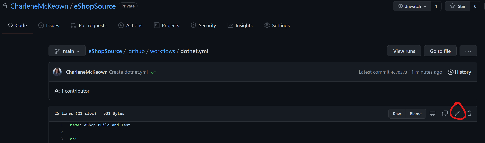

# GitHub Actions & Secrets

By the end of this lab, you will have updated your workflow file to build the application as a container image, and push that image to Azure Container Registry. 

## Building a Docker image

1. Click on **Code**, then .github/workflows and select your build.yml file (or whatever you called it).

1. Click the **edit** button.

    

    You will see, to the right of the file, a new pane has opened which allows us to search the GitHub marketplace for Actions. 

1. Search for 'Container Registry' and choose the Azure Container Registry Action published by **Azure**. 

    

1. Click on the copy button and then paste it into the bottom of your yaml file.

    

1. You may need to select the newly pasted text and tab twice to make sure the indentation is correct. It should look like this:

    ```
    name: eShop Build and Test

    on:
      push:
        branches: [ main ]
      pull_request:
        branches: [ main ]

    jobs:
      build:

        runs-on: ubuntu-latest

        steps:
        - uses: actions/checkout@v2
        - name: Setup .NET
          uses: actions/setup-dotnet@v1
          with:
            dotnet-version: 5.0.x
        - name: Restore dependencies
          run: dotnet restore ./eShopOnWeb.sln
        - name: Build
          run: dotnet build ./eShopOnWeb.sln --configuration Release
        - name: Test
          run: dotnet test ./eShopOnWeb.sln --configuration Release
          
        - name: Azure Container Registry Login
          uses: Azure/docker-login@v1
          with:
            # Container registry username
            username: # default is 
            # Container registry password
            password: # default is 
            # Container registry server url
            login-server: # default is https://index.docker.io/v1/
    ```

1. We do not want to expose credentials in our pipeline, so we can make use of GitHub Secrets.  For now, refer back to the values you saved earlier after creating your Container Registry. Update **username**, **password** and **login-server** values in your new step so it looks like this:


9. Go ahead and click **Start Commit**. This ensure the changes are saved, however, we are referencing secrets in our workflow that do not yet exist. The workflow will now fail. 

## Secrets

1. Click on **Settings**, **Secrets** and then **New repository secret**.

    

1. Create 3 secrets, pasting in the values you copied earlier:

    * ACR_USER
    * ACR_PASSWORD
    * ACR_SERVER

    > Note: Once you save them, they will be encrypted so you will not be able to see the values - double check they are correct before saving each one. 

1. Navigate to **Actions** and select the most recent run of the workflow - the one that failed (it will have a red cross beside it).  We can re-run the jobs by hitting that button:

    

    The workflow should work this time, as the secrets referenced in the workflow are now available to our workflow to pull down during the job run.

1. Navigate back to your workflow file in your repo, and click the edit button again. This time, we need to add a step in to build a Docker image and push it to the registry, now that we can log in.

1. This time, we are going to run a script instead of searching the marketplace for an action. Type the following into your workflow file at the end:

    <br>

    This is a multi line script which runs directly on the build agent. It will build the Dockerfile found in **src/Web** and then push it to the container registry. It will also tag it with the unique run id for the workflow.


  1. Before saving it, we should probably split our workflow file up into jobs. 

      We already have one job for building and testing the application, so let's create another for doing the container registry and Docker steps.

      After the dotnet test step, but before the Azure Container Registry Login step, paste in:

      ```
        buildPushAppImage:
          needs: build
          name: Build and Push to ACR
          runs-on: ubuntu-latest
          steps:
          - uses: actions/checkout@v2
      ```

      

      >Note: by writing **needs: build** means that this job will only run if the preceding job, **build**, was successful. In this way, we can make sure that the job that creates and pushes the container image only runs if the code builds and tests successfully.

  1. Commit your change and then navigate to the Actions tab again. You will now see your Action is running, but this time is split out into two visual jobs.

      
  
  
  1. Wait for it to succeed, then navigate back to the Azure portal and take a look at your ACR repositories.  You should now see a new repo **eshop** and inside that, our docker image with a tag which corresponds to the run id of the workflow. 

  

In the next lab, we will deploy a Web App for Containers and get it to do an initial pull from the container registry.

[Onward to Lab 3!](../lab.3/lab.3.md)
