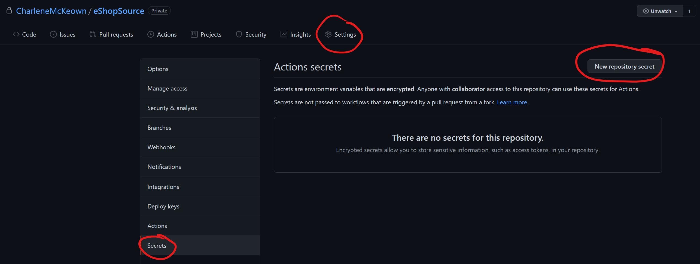

# Continuous Deployment Part 1

By the end of this lab, we will have built our Docker images and pushed them to ACR, all as part of the same workflow file. 

## Building a Docker image

1. Click on **Code**, then .github/workflows and select your dotnetcore.yml file. 
<br>
2. Click the **edit** button.


You will see, to the right of the file, a new pane has opened which allows us to search the GitHub marketplace for Actions. 

3. Search for 'Publish Docker' and choose the Action published by **elgohr**. 


4. Highlight the first 15 lines (all the way down to, and including, **dockerfile: # optional**)
<br>

5. Select line 20 in the file, and paste in what you just copied. You may need to select the newly pasted text and tab twice to make sure the indentation is correct. It should look like this:

```
uns-on: ubuntu-latest

    steps:
    - uses: actions/checkout@v1
    - name: Setup .NET Core
      uses: actions/setup-dotnet@v1
      with:
        dotnet-version: 3.1.100
    - name: Build with dotnet
      run: dotnet build ./eShopOnWeb.sln --configuration Release
    - name: Test with dotnet
      run: dotnet test ./eShopOnWeb.sln --configuration Release
    - name: Publish Docker
      uses: elgohr/Publish-Docker-Github-Action@2.12
      with:
        # The name of the image you would like to push
        name: 
        # The login username for the registry
        username: 
        # The login password for the registry
        password: 
        # Use registry for pushing to a custom registry
        registry: # optional
        # Use snapshot to push an additional image
        snapshot: # optional
        # Use dockerfile when you would like to explicitly build a Dockerfile
        dockerfile: # optional
```

6. Delete lines 31 & 32 (referring to snapshots - we won't be using these). You see we are left with some values that we need to complete.

We do not want to expose credentials in our pipeline, so we can make use of GitHub Secrets.  For now, refer back to the values you saved earlier after creating your ACR. 


Your file should now look like this:


9. Go ahead and click **Start Commit**. This ensure the changes are saved, however, we are referencing secrets in our workflow that do not yet exist. The workflow will now fail. 

## Secrets

1. Click on **Settings**, **Secrets** and then **Add new secret**.



2. Create 3 secrets, pasting in the values you copied earlier:

* ACR_USERNAME
* ACR_PASSWORD
* ACR_REGISTRY

> Note: Once you save them, they will be encrypted so you will not be able to see the values - double check they are correct before saving each one. 

3. Navigate to **Actions** and select the most recent run of the workflow - the one that failed (it will have a red cross beside it).  We can re-run the jobs but hitting that button:


The workflow should work this time, as the secrets referenced in the workflow are now available to our Workflow to pull down during the job run. 

Once it completes, navigate back to the Azure portal and take a look at your ACR repositories.  You should now see a new repo **eshopwebmvc** and inside that, our docker image with a tag of **latest**. 


In the next lab, we will deploy a Web App for Containers and set it up so that it always has the latest image from the container registry. 

[Onward to Lab 3!](../lab.3/lab.3.md)
