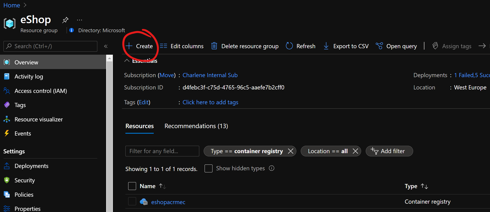
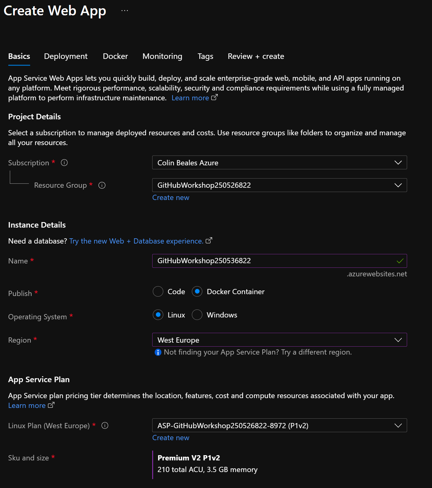
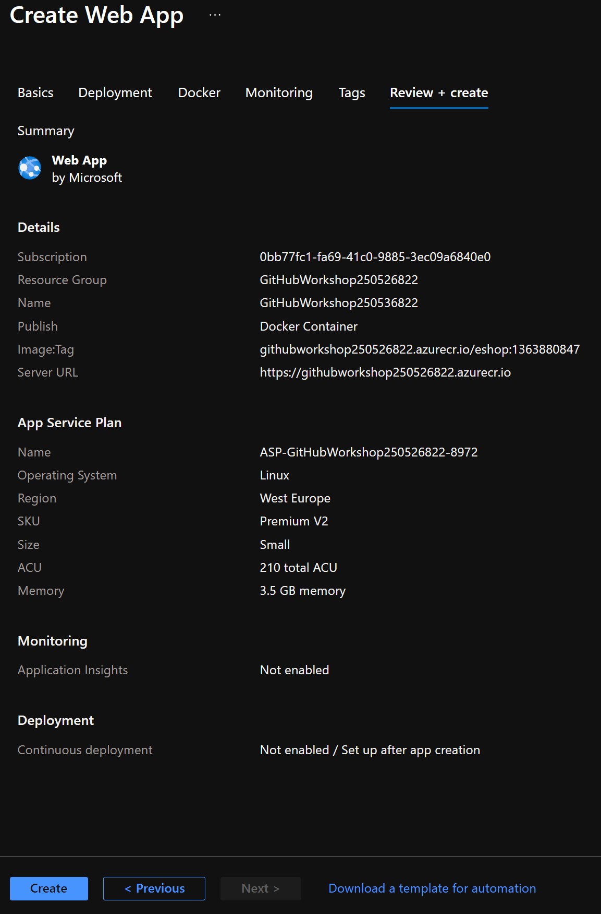

# Continuous Deployment Part 2

## Web App for Containers

We are going to host our container in an Azure App Service Plan. 

### Deploy resources

1. Navigate to the Azure Portal, and go to the Azure resource group containing your Container Registry. 

1. Click on **Create** and search for **Web App for Containers**.  Click **Create**.

    

    

1. On the next screen, leave the subscription and resource on default (if they aren't selected, choose the subscription and resource group you have been using in this lab). Leave everything else on default, apart from:

    * Name: Choose a unique name for your web app
    * Region: Choose the same region as you used earlier

    <br>

1. Click **Docker**

    * Change **Image Source** to **Azure Container Registry** and select your registry from the dropdown.  
    * Select the image **eshoponwebmvc** from the dropdown. 
    * Select the tag **latest** from the dropdown. 

    

1. Click **Review + create**. Once validated, click **create** and wait for your web app to deploy.

    

### Configuration

There is one configuration change we need to make.  

1. Navigate to your newly created web app, and click on **Configuration**.

1. Add a new Application Setting called **ASPNETCORE_ENVIRONMENT** and give it a value of **DEVELOPMENT**. Click **OK** and then **Save**.

    

    You can now browse to your website by clicking on **Browse** on the overview page - you should see the front end for our eShop:

    
    

Need a Lab 4 -- environments. 

step 1 - staging slot
step 2 - github environments
So what have we actually got working here? 

We have a CI/CD workflow which takes changes to our source code and builds and tests the .NET Core application to make sure we haven't broken anything.  The workflow then builds a Docker image using the Dockerfile we specified, and pushes that image into our private container registry hosted in Azure.  The Web app will pull down the latest container image, and restart the application to reflect our changes.

Don't believe me? 

### Testing it all works

1. Navigate back to your GitHub repo, and find a file called **_Layout.cshtml**. It's in /src/Web/Views/Shared:


2. Scroll down to line 46, and replace it with the following:

```
<div class="esh-app-footer-text hidden-xs"> e-ShopOnWeb. Deployed with GitHub and Azure. All rights reserved </div>
```

3. Commit your changes. Your workflow will run one more time, and push the new Docker image to the Container Registry. Wait for the pipeline to finish, then browse to your website. You should see the change reflected in the header at the bottom. You can also confirm the new image was pulled by looking at the logs in **Container settings** for your Web App. 


