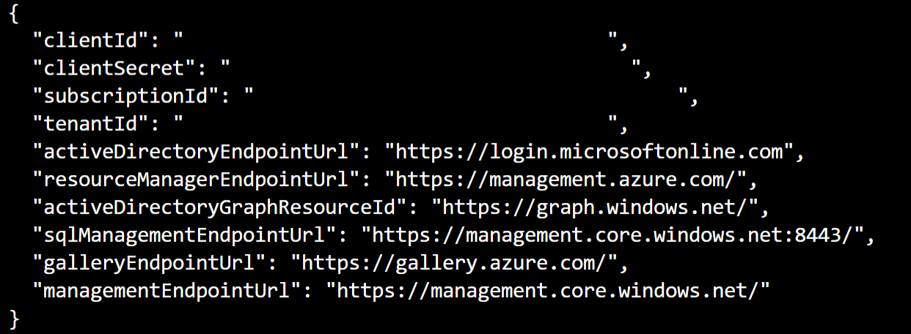

# GitHub Environments

## Azure App Service Deployment Slots
<br>
The first thing we need to do is add a deployment slot to the website. You can think of a deployment slot as simply a copy of your website, complete with its own host name. 

<br>They are useful for scenarios like blue-green or canary. For example, you could deploy a change to your staging website, divert a percentage of real user traffic to it, and observe and monitor how users interact with it. The staging slot can then be swapped with production once the change has been validated. You can also roll back changes simply by swapping the slots back again. 

### Add a Staging Slot

1. Navigate to your web app in the Azure portal, and find **Deployment Slots** in the left hand pane. Click it, and then click on **Add Slot**. 

    

1. Call your new slot **staging**, click **Clone Settings** and then click **Add**. 

    

    You will see your new slot - note that currently 0% of traffic is going to the slot. Feel free to click on it, and browse to the site. It's the same as your production site right now.

    

    While we are here, we need to create a service principal so that we can use it to deploy changes to the web app using GitHub Actions.

1. Open Cloud Shell from the Azure Portal (top right hand side - see below for the icon. If you have never used it before, you will be prompted to create a storage account - go ahead and do that.)

    

1. Paste the following into the Cloud Shell (make sure you are in a bash session). Be sure to replace:

    - GitHubWorkShop******** with your resource group name
    - {SubID} with your subscriptionId (you will find this in the **Overview** section for your Resource Group)

    ```
    az ad sp create-for-rbac -n "GitHubWorkShop********" --role Contributor --scopes /subscriptions/{SubID}/resourceGroups/GitHubWorkShop********
    ```

1. After a few seconds, you will get the details of your newly created service principal. Copy and paste them into notepad. 


    <br>

1. We need to change this slightly. Update **appId** to **clientId**, **password** to **clientSecret**, **tenant** to **tenantId** and finally, add in a new key value pair for your **subscriptionId**. Your service principal details should now look like the below (with your own values):

    ``` 
        {
        "clientId": "683b4c69-f60d-417f-b299-7034d03659e9",
        "displayName": "GitHubWorkShop12345678",
        "name": "683b4c69-f60d-417f-b299-7034d03659e9",
        "clientSecret": "",
        "tenantId": "",
        "subscriptionId": ""
        }
    ```

    Keep this in notepad - you will need it shortly. 

## GitHub Environments

GitHub Environments allow you to deploy to specific environments that you specify - like staging or production. You can do things like: 

- ensure that only specific branches can be deployed to an environment (e.g. only main can be deployed to production)
- create environment specific secrets only accessible to the job carrying out the deployment
- assign people or teams to approve environment deployments
- set delays


1. In your GitHub repo, navigate to **Settings** and then **Secrets**. 
1. Add a new secret called **AZURE_CREDENTIALS** and paste in the service principal you just modified. Save it. 
1. Navigate to **Environments** in the Settings pane and click **New environment**. On the next page, name your environment **Staging** then proceed to **Configure environment**.

    <br>

1. We actually don't need to set any protection rules here, so go back and create another environment, this time called **Production**.

1. Configure the Production environment so that it has one required reviewer (you!) and make sure that you limit deployment branches to main. Be sure to click **Save protection rules**.

    <br>

## Deployment jobs

We now need to update the workflow file to add two new jobs:

- One to deploy the new container image to the staging website
- One to swap the staging slot with the production slot

1. Navigate to your workflow file in the repo, and click the edit button. 
1. At the end of the file, add in a new job:

    ```
    deployStaging:
        runs-on: ubuntu-latest
        needs: buildPushAppImage
        environment: staging
        steps:
    ```
    >Note: We set a dependency between this job and the one before it using a **needs** statement. 
1. Copy the action you used earlier to login to the Container Registry and paste it in below **steps:**.
1. In the marketplace to the right, find the **Azure Login** action, then copy and paste it into the bottom of your workflow file. 
    <br>
1. Remove everything under **with:** except for **creds**. Here, we need to reference the service principal secret you saved earlier, like this: 
    <br>
1. In the marketplace to the right, search for **Azure web app** and find the action called **Azure WebApp**. Click on it, then copy and paste the action into your workflow file. 


    <br>

1. Underneath **with**, delete everything except:

    - app-name:
    - slot-name:
    - images:

1. Set the app-name to your webapp name (it should be GitHubWorkShop*******, replacing the asterix with your unique suffix).
1. Set the slot-name to **staging**
1. Set images to the image name. This will look like in the below:
    <br>
    Your job should now look like this:
    <br>

1. Add another job, this time for production:

    ```
        deployProduction:
            runs-on: ubuntu-latest
            needs: deployStaging
            environment: production
            steps:
    ```

1. Add in a step for Azure login as before.
1. Create a new step to run a single line command. Copy and paste in the below, replacing the **name** and **resource group** with your own:

    ```
        - name: Swap staging to production
            run: |
            az webapp deployment slot swap --name GitHubWorkShop12345678 --resource-group GitHubWorkShop12345678 --slot staging --target-slot production

    ```

1. Your job should now look like this: 

    <br>

1. Commit your changes and then navigate to the Actions tab. You should see your workflow in progress:

    <br>

    After a few minutes, you should see that the workflow will stop before the deployProduction stage. Go ahead and click into it and approve. 

    <br>

### Next Steps

Here are some ideas for improving your current workflow:

1. Introduce branch policy to protect main.
1. Improve your workflow to run build and test of your code for each pull request.

### Learning Resources

[MS Learn: GitHub Actions Learning Path](https://docs.microsoft.com/en-us/learn/paths/automate-workflow-github-actions/) - Taking approximately 5 hours to complete, this learning path covers many key areas for automating workflows and contains a bunch of hands on labs from GitHub Learning Lab.

[GitHub Actions for Project Management](https://docs.github.com/en/actions/managing-issues-and-pull-requests/using-github-actions-for-project-management) - Go beyond just CI/CD and learn how to use Actions for Project Management tasks.

[GitHub Public Roadmap](https://github.com/github/roadmap/projects/1?card_filter_query=actions) - Actions is improving all the time - keep an eye out on the public roadmap for upcoming features.